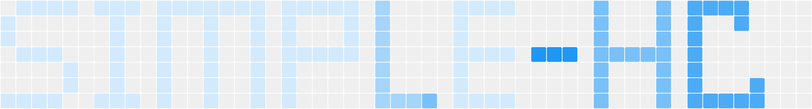

# Simple Heatmap Calendar



Powerful and easy-to-use heatmap flutter chart package.

## Features

Check example by run code `example/main.dart`


```shell
cd exmaple
flutter pub get
flutter run --debug # --profile or --release
```
## Getting started

### Add dependency with `flutter pub add` command

```shell
flutter pub add simple_heatmap_calendar
```

### **Or** Add below line to `pubspec.yaml `

```yaml
dependencies:
  ...
  simple_heatmap_calendar: any  # or special version

```

Then run `flutter pub get`

## Usage

```Dart
class HomePage extends StatefulWidget {
  const HomePage({super.key});

  @override
  State<StatefulWidget> createState() => _HomePage();
}

class _HomePage extends State<HomePage> {
  @override
  Widget build(BuildContext context) {
    var theme = Theme.of(context);
    return Scaffold(
      appBar: AppBar(title: const Text("Simple Heatmap Calendar")),
      body: Card(
        child: Padding(
          padding: const EdgeInsets.all(10.0),
          child: HeatmapCalendar<num>(
            startDate: DateTime(2020, 1, 1),
            endedDate: DateTime(2025, 12, 31),
            colorMap: {
              10: theme.primaryColor.withOpacity(0.2),
              20: theme.primaryColor.withOpacity(0.4),
              30: theme.primaryColor.withOpacity(0.6),
              40: theme.primaryColor.withOpacity(0.8),
              50: theme.primaryColor,
            },
            selectedMap: {
              DateTime(2025, 12, 31): 10,
              DateTime(2025, 12, 30): 20,
              DateTime(2025, 12, 29): 30,
              DateTime(2025, 12, 28): 40,
              DateTime(2025, 12, 26): 50,
              DateTime(2025, 12, 22): 60,
              DateTime(2025, 12, 12): 999,
              DateTime(2025, 12, 1): 0,
              DateTime(2025, 11, 23): 12,
              DateTime(2025, 12, 16): 34,
              DateTime(2025, 12, 15): 45,
              DateTime(2025, 12, 12): 89,
              DateTime(2020, 1, 16): 34,
              DateTime(2020, 1, 15): 45,
              DateTime(2020, 1, 12): 89,
            },
            cellSize: const Size.square(16.0),
            colorTipCellSize: const Size.square(12.0),
            style: const HeatmapCalendarStyle.defaults(
              cellValueFontSize: 6.0,
              cellRadius: BorderRadius.all(Radius.circular(4.0)),
              weekLabelValueFontSize: 12.0,
              monthLabelFontSize: 12.0,
            ),
            layoutParameters: const HeatmapLayoutParameters.defaults(
              monthLabelPosition: CalendarMonthLabelPosition.top,
              weekLabelPosition: CalendarWeekLabelPosition.right,
              colorTipPosition: CalendarColorTipPosition.bottom,
            ),
          ),
        ),
      ),
    );
  }
}

```


## License

```text
MIT License

Copyright (c) 2023 Fries_I23

Permission is hereby granted, free of charge, to any person obtaining a copy
of this software and associated documentation files (the "Software"), to deal
in the Software without restriction, including without limitation the rights
to use, copy, modify, merge, publish, distribute, sublicense, and/or sell
copies of the Software, and to permit persons to whom the Software is
furnished to do so, subject to the following conditions:

The above copyright notice and this permission notice shall be included in all
copies or substantial portions of the Software.

THE SOFTWARE IS PROVIDED "AS IS", WITHOUT WARRANTY OF ANY KIND, EXPRESS OR
IMPLIED, INCLUDING BUT NOT LIMITED TO THE WARRANTIES OF MERCHANTABILITY,
FITNESS FOR A PARTICULAR PURPOSE AND NONINFRINGEMENT. IN NO EVENT SHALL THE
AUTHORS OR COPYRIGHT HOLDERS BE LIABLE FOR ANY CLAIM, DAMAGES OR OTHER
LIABILITY, WHETHER IN AN ACTION OF CONTRACT, TORT OR OTHERWISE, ARISING FROM,
OUT OF OR IN CONNECTION WITH THE SOFTWARE OR THE USE OR OTHER DEALINGS IN THE
SOFTWARE.

```